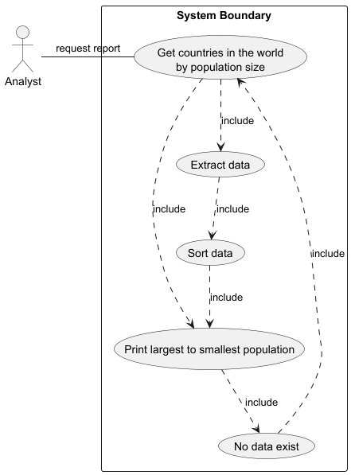

# USE CASE: 1 Produce a Report on All Countries in the World by Population

## CHARACTERISTIC INFORMATION

### Goal in Context

As an analyst I want to produce a report of all countries in the world organised by largest to smallest population so that I can compare national populations globally.

### Scope

Company.

### Level

Primary task.

### Preconditions

Database contains country data with population.

### Success End Condition

Report of all countries sorted by population is produced.
### Failed End Condition

No report is produced.

### Primary Actor

Analyst.

### Trigger

Finance or management request global population comparison.

## MAIN SUCCESS SCENARIO

  1. Analyst requests report of all countries.
  2. System extracts all country population data.
  3. System sorts countries by population descending.
  4. System generates the report.
  5. Analyst provides report to requester.

## EXTENSIONS

  2. No country data:
    1. Analyst informs requester no data exists.

## SUB-VARIATIONS

None.
## Use case diagram 

## SCHEDULE

DUE DATE: Release 1.0
