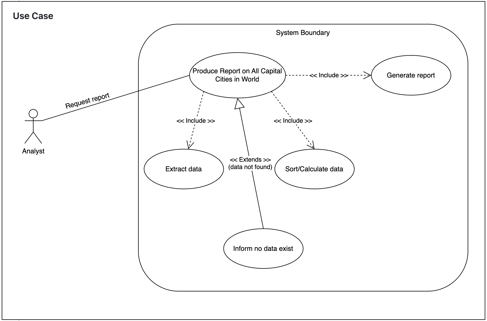

# USE CASE: 17 Produce a Report on All Capital Cities in the World by Population

## CHARACTERISTIC INFORMATION

### Goal in Context

As an analyst I want to produce a report of all capital cities in the world organised by largest to smallest population so that I can compare populations of world capitals.

### Scope

Company.

### Level

Primary task.

### Preconditions

Database contains relevant data.

### Success End Condition

Report is produced.
### Failed End Condition

No report is produced.

### Primary Actor

Analyst.

### Trigger

Request for this report.

## MAIN SUCCESS SCENARIO

  1. Analyst requests produce a report on all capital cities in the world by population.
  2. System extracts relevant data.
  3. System sorts/calculates as required.
  4. System generates the report.

## EXTENSIONS

  1. Data not found:
    1.1 Analyst informed no data exists.

## SUB-VARIATIONS

None.

## Use case diagram

## SCHEDULE

DUE DATE: Release 3.0
