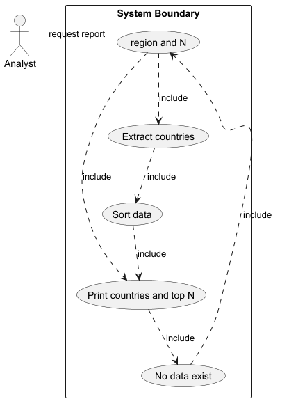

# USE CASE: 6 Produce a Report on Top N Countries in a Region

## CHARACTERISTIC INFORMATION

### Goal in Context

As an analyst I want to produce a report of the top N most populated countries in a region where N is provided so that I can focus on the largest countries within that region.

### Scope

Company.

### Level

Primary task.

### Preconditions

Database contains country population and region data.

### Success End Condition

Report of top N countries in region by population is produced.
### Failed End Condition

No report is produced.

### Primary Actor

Analyst.

### Trigger

Request for top N countries in region.

## MAIN SUCCESS SCENARIO

  1. Analyst enters region and N.
  2. System extracts countries of region.
  3. System sorts and selects top N.
  4. System generates report.

## EXTENSIONS

  2. Region not found:
    1. Analyst informed no such region.

## SUB-VARIATIONS

## Use case diagram

None.

## SCHEDULE

DUE DATE: Release 1.5
